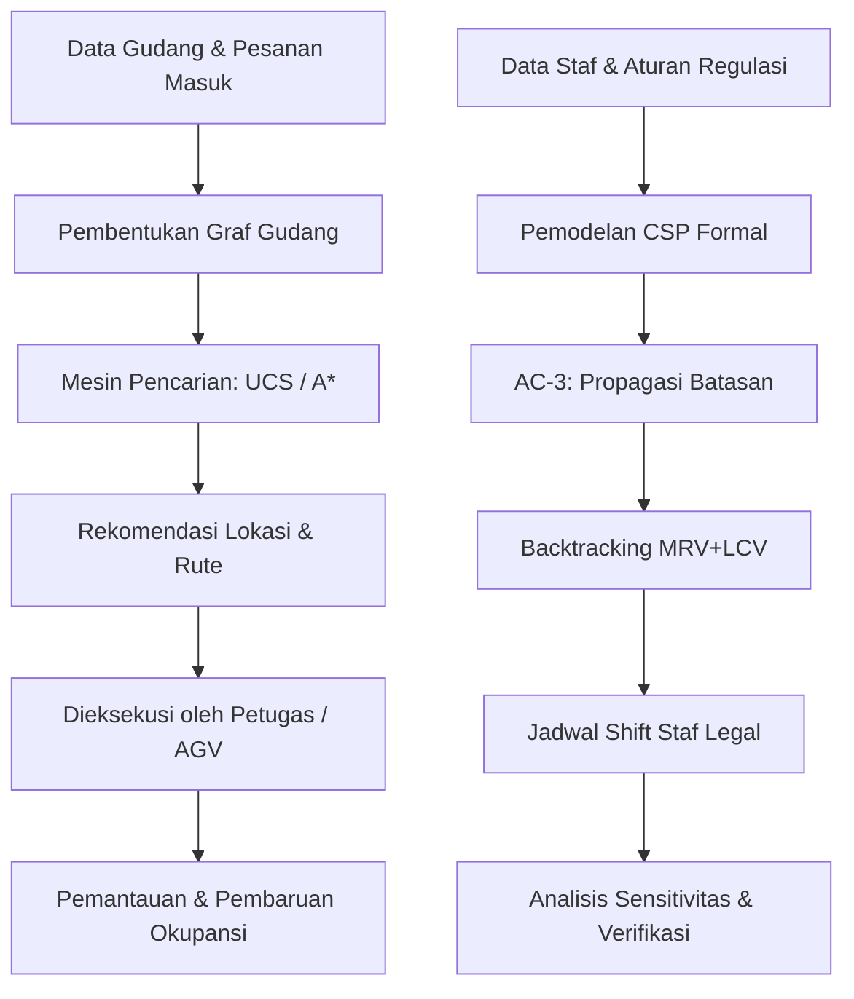
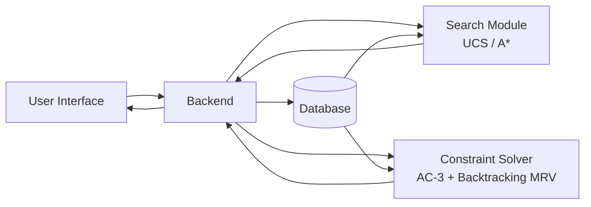

# Smart Warehouse Agent

### Agen Cerdas Berbasis Pencarian & Constraint Solver untuk Optimasi Penyimpanan, Pengambilan, dan Penjadwalan Sumber Daya Gudang

<div align="center">

[](https://www.python.org/)
[](https://docs.astral.sh/uv/)
[](LICENSE)
[](#rencana-pengembangan-roadmap)
[](#rencana-pengembangan-roadmap)

</div>

Smart Warehouse Agent adalah proyek AI mahasiswa yang dikembangkan bertahap selama satu semester. Sistem ini membantu pengelola gudang dalam dua aspek utama: (1) menemukan lokasi penyimpanan barang terbaik (*put-away*) dan jalur pengambilan tercepat (*retrieval*) melalui algoritma pencarian berbasis graf, serta (2) menghasilkan penjadwalan shift staf yang legal dan optimal melalui *constraint solver* berbasis CSP.

---

## Isi Dokumen

1. [Ringkasan Proyek](#ringkasan-proyek)
2. [Tujuan](#tujuan)
3. [Latar Belakang Masalah](#latar-belakang-masalah)
4. [Pendekatan AI yang Digunakan](#pendekatan-ai-yang-digunakan)
5. [Spesifikasi PEAS](#spesifikasi-peas)
6. [Kemampuan Sistem](#kemampuan-sistem)
7. [Alur Kerja Sistem](#alur-kerja-sistem)
8. [Arsitektur Sistem](#arsitektur-sistem)
9. [Rencana Pengembangan (Roadmap)](#rencana-pengembangan-roadmap)
10. [Struktur Direktori](#struktur-direktori)
11. [Persiapan & Instalasi](#persiapan--instalasi)
12. [Menjalankan Program](#menjalankan-program)
13. [Studi Kasus](#studi-kasus)
14. [Rencana Lanjutan](#rencana-lanjutan)
15. [Anggota Tim](#anggota-tim)
16. [Lisensi](#lisensi)

---

## Ringkasan Proyek

Di banyak gudang, keputusan meletakkan dan mengambil barang masih mengandalkan intuisi staf, bukan perhitungan sistematis atas jarak tempuh, kepadatan lorong, maupun karakteristik barang itu sendiri. Selain itu, penjadwalan shift staf seringkali dilakukan secara manual sehingga rawan melanggar regulasi ketenagakerjaan (batas jam kerja, aturan istirahat antar-shift, ketersediaan staf).

Smart Warehouse Agent menjawab kedua tantangan ini secara bersamaan:

- **Modul Pencarian Graf** — merepresentasikan denah gudang sebagai graf berbobot dan menjalankan UCS/A* untuk menemukan lintasan put-away/retrieval optimal.
- **Modul Constraint Solver** — memodelkan penjadwalan shift staf sebagai CSP (*Constraint Satisfaction Problem*) dan menggunakannya untuk menghasilkan jadwal yang legal, efisien, dan terverifikasi secara matematis.

## Tujuan

- Menekan total jarak/waktu tempuh selama proses put-away maupun picking.
- Mendorong pemanfaatan ruang penyimpanan gudang seoptimal mungkin.
- Menurunkan potensi salah taruh atau salah ambil barang akibat keputusan manual.
- Menghadirkan baseline algoritma pencarian (UCS & A*) sebagai pijakan awal optimasi keputusan penyimpanan dan rute.
- Menghasilkan jadwal shift staf yang memenuhi semua batasan bisnis & regulasi ketenagakerjaan secara otomatis melalui CSP solver.
- Membuka ruang pengembangan lanjutan berupa prediksi permintaan dan slotting yang adaptif.

## Latar Belakang Masalah

Beberapa persoalan nyata yang melatarbelakangi proyek ini:

- Rak penyimpanan tidak terisi optimal karena barang kerap ditaruh di slot yang tidak cocok dengan kategori/ukurannya.
- Durasi pengambilan barang (picking time) membengkak sebab barang yang laris (fast-moving) belum tentu berada di titik yang strategis.
- Salah catat lokasi barang memperbesar risiko selisih data stok.
- Penempatan barang masih bersifat reaktif, belum memperhitungkan pola permintaan atau keterkaitan antar-pesanan.
- Sistem manual sulit menyesuaikan diri ketika volume pesanan melonjak, misalnya pada momen promosi besar.
- Penjadwalan shift staf manual rawan melanggar aturan ketenagakerjaan (batas jam kerja, larangan shift malam diikuti shift pagi, kuota staf minimum per shift).

## Pendekatan AI yang Digunakan

### Milestone 1 — Pencarian Berbasis Graf (UCS & A*)

Denah gudang diubah menjadi graf berbobot: node mewakili dock, persimpangan lorong, dan slot rak; edge mewakili jarak/waktu tempuh sesungguhnya.

- **UCS** (*Uniform Cost Search*): menjamin lintasan berbiaya minimum dengan f(n) = g(n).
- **A\*** dengan heuristik Manhattan: mempercepat pencarian dengan f(n) = g(n) + h(n) sambil tetap menjamin optimalitas.

### Milestone 2 — Constraint Solver Berbasis CSP

Penjadwalan shift staf dimodelkan sebagai CSP formal:

**Pemodelan Matematis:**

```
Variabel  X = { X_{d,t,k} | d ∈ Days, t ∈ {Morning, Afternoon, Night}, k ∈ {1..slots} }
Domain    D_{d,t,k} ⊆ Staff  (staf yang tersedia pada slot tersebut)
Batasan   C = { C1, C2, C3, C4 }

  C1 (AllDiff/hari)  : ∀ d, ∀ i≠j pada hari d → X_i ≠ X_j
  C2 (Istirahat)     : ∀ s — jika s bekerja NIGHT hari d → s ∉ MORNING hari d+1
  C3 (Kapasitas)     : jumlah slot per shift ∈ [min_cap, max_cap]  (struktural)
  C4 (Batas Jam)     : ∀ s ∈ Staff — Σ jam_kerja(X=s) ≤ max_hours_per_week
```

**Algoritma:**

1. **AC-3** (*Arc Consistency 3*) — propagasi batasan untuk memangkas domain sebelum pencarian.
2. **Backtracking + MRV + LCV + Forward Checking** — pencarian solusi dengan heuristik:
   - MRV (*Minimum Remaining Values*): pilih variabel dengan domain terkecil dahulu.
   - LCV (*Least Constraining Value*): urutkan nilai yang paling sedikit memangkas domain tetangga.
   - Forward Checking: pangkas domain tetangga langsung setelah setiap penugasan.

## Spesifikasi PEAS

| Komponen | Penjabaran pada Smart Warehouse Agent |
| --- | --- |
| **Performance Measure** | Total jarak/waktu tempuh put-away & picking, tingkat pemanfaatan ruang penyimpanan, rata-rata waktu penyelesaian pesanan, tingkat kesalahan penempatan/pengambilan, serta kepatuhan jadwal shift terhadap batasan regulasi ketenagakerjaan. |
| **Environment** | Denah gudang berupa graf rak/lorong, status keterisian tiap slot, atribut SKU (dimensi, berat, kategori, turnover rate), antrean pesanan masuk/keluar, daftar staf & ketersediaannya. |
| **Actuators** | Perintah gerak ke AGV/perangkat genggam petugas, pembaruan status slot pada sistem WMS, instruksi ke conveyor/sorter, pembaruan pick-list digital/label rak, dan penerbitan jadwal shift staf. |
| **Sensors** | Pemindai barcode/RFID, sensor berat & dimensi di dock penerimaan, kamera/computer vision untuk memantau keterisian dan kepadatan lorong, dan feed data real-time dari WMS/ERP. |

## Kemampuan Sistem

- **Pemodelan Graf Gudang** — mengubah denah gudang menjadi graf berbobot lengkap dengan jarak/waktu tempuh antar-titik.
- **Rekomendasi Put-away** — menyarankan lokasi penyimpanan optimal memakai baseline UCS.
- **Optimasi Rute Pengambilan** — menghitung rute pengambilan tercepat memakai A* dengan heuristik Manhattan distance.
- **Perbandingan Biaya & Performa** — membandingkan biaya lintasan serta jumlah node yang dijelajahi antara UCS dan A*.
- **Penjadwalan Shift Staf (CSP)** — menghasilkan jadwal shift yang memenuhi semua batasan regulasi ketenagakerjaan secara otomatis.
- **Analisis Sensitivitas** — menguji kinerja solver pada berbagai skala masalah dan melaporkan waktu konvergensi.
- *(Lanjutan)* **Kesadaran Slot Stok** — rekomendasi slotting berdasarkan kategori dan turnover barang.
- *(Lanjutan)* **Slotting Berbasis Permintaan** — penyesuaian slotting mengikuti prediksi pola permintaan.

## Alur Kerja Sistem



## Arsitektur Sistem



- **Antarmuka Pengguna** — tempat petugas/pengelola gudang memasukkan data barang, pesanan, dan staf; sekaligus melihat rekomendasi, jadwal shift, dan peringatan.
- **Backend** — menangani validasi input, pembentukan graf gudang, serta komunikasi antar-komponen.
- **Basis Data** — menyimpan data denah gudang, SKU, okupansi rak, histori transaksi, dan data staf.
- **Modul Pencarian/AI** — menjalankan UCS/A* untuk optimasi rute dan lokasi penyimpanan.
- **Modul Constraint Solver** — menjalankan AC-3 + Backtracking MRV untuk penjadwalan shift staf yang legal dan optimal.

## Rencana Pengembangan (Roadmap)

| Milestone | Fokus Utama | Luaran | Status |
| --- | --- | --- | --- |
| **M1** | Perumusan Masalah & Perencanaan Proyek | Business problem framing, spesifikasi PEAS, formulasi ruang keadaan (X, A, T, G, C), baseline UCS/A*, dan repositori GitHub awal. | ✅ Selesai |
| **M2** | Constraint Solver & Pemodelan Matematis Formal | Pemodelan CSP formal (variabel, domain, batasan C1–C4), implementasi AC-3 + Backtracking MRV+LCV, analisis sensitivitas, dan pengujian otomatis lengkap. | ✅ Selesai |
| **M3** | Pemrosesan Data & Pengembangan Model AI | Pra-pemrosesan data, perluasan graf gudang, eksplorasi model prediksi permintaan, dan evaluasi awal algoritma pencarian pada skala lebih besar. | 🔲 Belum dimulai |
| **M4** | Integrasi Sistem & Dashboard | Penggabungan modul pencarian, slotting, constraint solver, penyimpanan data, serta dashboard visualisasi denah gudang. | 🔲 Belum dimulai |
| **M5** | Pengujian, Evaluasi & Presentasi Akhir | Pengujian sistem, evaluasi hasil, pembahasan keterbatasan, dokumentasi, dan presentasi akhir. | 🔲 Belum dimulai |

## Struktur Direktori

```text
smart-warehouse-agent/
├── README.md
├── LICENSE
├── .gitignore
├── pyproject.toml
├── requirements.txt
├── src/
│   ├── warehouse_search.py     ← M1: Baseline UCS & A* (pencarian graf gudang)
│   ├── solver.py               ← M2: CSP Solver (AC-3 + Backtracking MRV+LCV)
│   └── data_loader.py          ← Loader dataset CSV/JSON → format siap pakai
├── data/
│   ├── generate_datasets.py    ← Script pembuat dataset CSV & Excel
│   ├── raw/                    ← Dataset mentah (CSV & JSON)
│   │   ├── items_inventory.*       (Data SKU, kategori, berat, lokasi rak)
│   │   ├── orders.*                (Data pesanan MASUK/KELUAR + rute)
│   │   ├── staff_data.*            (Data staf, jabatan, libur, preferensi)
│   │   ├── warehouse_layout.json   (Data graf denah gudang komprehensif)
│   │   └── warehouse_nodes.csv     (Data ringkasan node denah gudang)
│   └── processed/
│       └── smart_warehouse_dataset.xlsx   ← Semua dataset dalam 1 file Excel (5 sheet)
├── tests/
│   ├── test_warehouse_search.py  ← M1: Unit tests UCS & A*
│   └── test_solver.py            ← M2: Unit tests CSP (termasuk edge cases)
└── docs/
```

### Keterangan Dataset

| File | Format | Deskripsi |
|---|---|---|
| `staff_data` | `.csv`, `.json` | Data staf aktif: jabatan, hari libur, preferensi & maks jam shift |
| `items_inventory` | `.csv`, `.json` | Katalog SKU: kategori, dimensi, harga, turnover, lokasi rak, stok |
| `orders` | `.csv`, `.json` | Log pesanan MASUK/KELUAR: node asal-tujuan, biaya rute, status |
| `warehouse_layout`| `.json` | Graf gudang lengkap (nodes & edges berbobot untuk UCS/A*) |
| `warehouse_nodes` | `.csv` | Ringkasan node denah gudang: tipe, koordinat (x,y), kapasitas |
| `smart_warehouse_dataset` | `.xlsx` | Gabungan semua tabel di atas dalam 5 sheet berformat profesional |

> Untuk meregenerasi dataset `.csv` dan `.xlsx`: `uv run python data/generate_datasets.py`

## Persiapan & Instalasi

### Yang perlu disiapkan

- Python versi **3.10 ke atas**.
- [Astral `uv`](https://docs.astral.sh/uv/getting-started/installation/) sudah terpasang pada `PATH`.
- Git untuk mengambil dan mengelola repository ini.

### Membangun environment

Dari root repository, jalankan:

```bash
uv venv
uv sync
```

Mengaktifkan environment (opsional):

```bash
# Windows PowerShell
.venv\Scripts\Activate.ps1

# Linux/macOS
source .venv/bin/activate
```

Seluruh modul (M1 & M2) hanya menggunakan pustaka standar Python — tidak ada dependency eksternal yang diperlukan.

## Menjalankan Program

### Modul M1 — Pencarian Graf Gudang (UCS & A*)

```bash
uv run python src/warehouse_search.py
```

Output berupa perbandingan lintasan, biaya, dan jumlah node yang dijelajahi antara UCS dan A*.

### Modul M2 — Constraint Solver CSP (Penjadwalan Shift Staf)

```bash
uv run python src/solver.py
```

Output berupa:
1. **Kasus 1**: Jadwal shift staf normal (5 staf, 5 hari, 3 shift/hari)
2. **Kasus 2**: Jadwal dengan staf yang memiliki hari tidak tersedia
3. **Kasus 3**: Jadwal multi-slot (2 staf per shift)
4. **Analisis Sensitivitas**: Tabel kinerja solver pada berbagai skala masalah

### Dataset — Generate File CSV & Excel

Membuat (atau meregenerasi) semua file dataset dummy ke `data/raw/` dan `data/processed/`:

```bash
uv run python data/generate_datasets.py
```

Output berupa 4 file `.csv` di `data/raw/` dan 1 file `.xlsx` di `data/processed/`.

### Dataset — Ringkasan & Integrasi ke Modul AI

Menampilkan ringkasan isi semua dataset dan menjalankan demo integrasi ke `solver.py` serta `warehouse_search.py`:

```bash
uv run python src/data_loader.py
```

Modul `data_loader.py` juga bisa diimpor langsung di kode lain:

```python
from src.data_loader import load_warehouse_graph, load_staff_for_csp, load_inventory, load_orders

# Muat denah gudang → langsung pakai di UCS / A*
graph, coordinates = load_warehouse_graph()

# Muat data staf → langsung pakai di build_shift_scheduling_csp()
staff_names, unavailable, n_days, max_hours = load_staff_for_csp()

# Muat inventori & pesanan → untuk analisis lanjutan (Milestone 3+)
items  = load_inventory()
orders = load_orders()
```

### Menjalankan Semua Pengujian Otomatis

```bash
uv run pytest tests/ -v
```

Output menampilkan seluruh test case M1 dan M2, termasuk edge cases.

```bash
# Hanya M1
uv run pytest tests/test_warehouse_search.py -v

# Hanya M2
uv run pytest tests/test_solver.py -v
```

## Studi Kasus

### Studi Kasus 1 — Optimasi Rute Pengambilan (M1)

Misalkan Gudang Nusantara Logistik baru saja menerima kiriman barang:

1. Barang tiba di dock penerimaan dan atributnya dicatat (dimensi, berat, kategori);
2. Sistem membentuk graf gudang berdasarkan denah lorong dan rak yang berlaku saat ini;
3. Algoritma UCS/A* mencari lintasan berbiaya (jarak/waktu) paling rendah dari dock menuju slot rak tujuan;
4. Sistem memberikan rekomendasi lokasi penyimpanan dan/atau rute pengambilan yang optimal; dan
5. Petugas atau AGV menjalankan instruksi actuator untuk menuntaskan proses put-away maupun picking.

### Studi Kasus 2 — Penjadwalan Shift Staf (M2)

Misalkan Gudang Nusantara Logistik perlu menyusun jadwal shift 5 staf untuk 5 hari kerja:

1. Manajer memasukkan daftar staf, ketersediaan, dan aturan regulasi (maks. 40 jam/minggu, larangan shift malam→pagi berturutan);
2. Sistem memodelkan masalah sebagai CSP formal (variabel, domain, batasan C1–C4);
3. AC-3 memangkas domain yang tidak konsisten sebelum pencarian dimulai;
4. Backtracking MRV+LCV menemukan jadwal shift yang memenuhi semua batasan;
5. Sistem memverifikasi setiap batasan dan menampilkan jadwal akhir yang siap dieksekusi.

## Rencana Lanjutan

Beberapa arah pengembangan berikut masih terbuka untuk dipertimbangkan:

- Menghadirkan model prediksi permintaan (demand forecasting) untuk slotting yang adaptif;
- Mengembangkan koordinasi multi-agent bagi beberapa AGV/petugas sekaligus;
- Menambahkan penalti kongesti yang dinamis pada fungsi biaya (cost function);
- Membangun dashboard visual untuk denah gudang dan status okupansi rak; dan
- Menguji algoritma pencarian pada graf gudang berskala jauh lebih besar dan kompleks.

Daftar di atas adalah kemungkinan arah pengembangan, bukan klaim bahwa fitur tersebut sudah tersedia atau bersifat final.

## Anggota Tim

| Nama | NIM | Peran M1 | Peran M2 |
| --- | --- | --- | --- |
| Nicolas J Grace Butarbutar | 12S24038 | Search Algorithm Engineer & Repository Maintainer | CSP Solver Developer (AC-3, Backtracking MRV+LCV, Forward Checking) & Repository Maintainer |
| Indah Triyuni Siahaan | 12S24052 | Business Analyst & Requirements / Problem Framing | CSP Domain Modeler (Pemodelan Matematis Formal: variabel, domain, batasan C1–C4) & Business Rules Analyst |
| Swasti Maristella Sihombing | 12S24030 | PEAS, Testing & System Documentation Specialist | Testing Specialist (Unit Tests, Edge Cases, Sensitivity Analysis) & System Documentation |

## Lisensi

Repositori ini dilisensikan di bawah **MIT License**. Ketentuan selengkapnya dapat dilihat pada berkas [LICENSE](LICENSE).

---

*Disusun untuk memenuhi rangkaian proyek terpadu mata kuliah **10S3001 - Kecerdasan Buatan**, Program Studi Sarjana Sistem Informasi, Institut Teknologi Del, Semester Gasal 2026/2027, di bawah bimbingan dosen pengampu **Samuel Indra Gunawan Situmeang**.*
